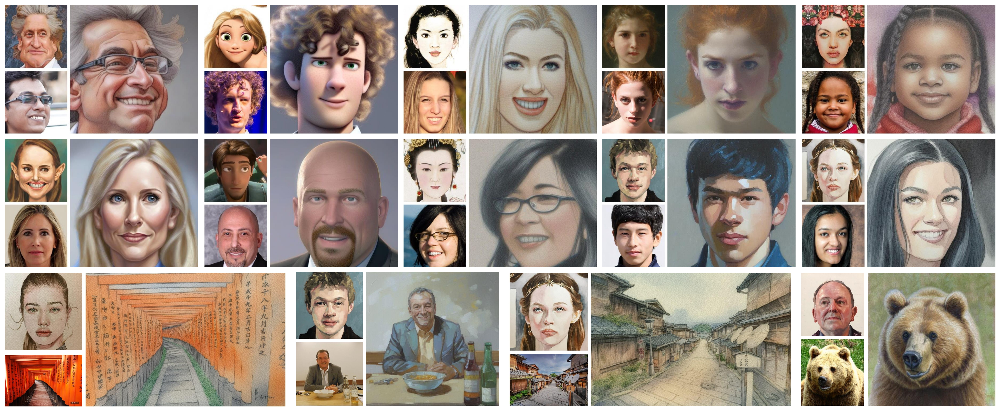

# One-Shot Portrait Stylization

- An One-shot portrait stylization algorithm based on StableDiffusion and LoRA
- Could also be applied on other domains such as animals, objects and sceneries.
- Developed for fun during my spare time, now working on the paper. 
- Code and model may be publicly available after the paper is accepted.

